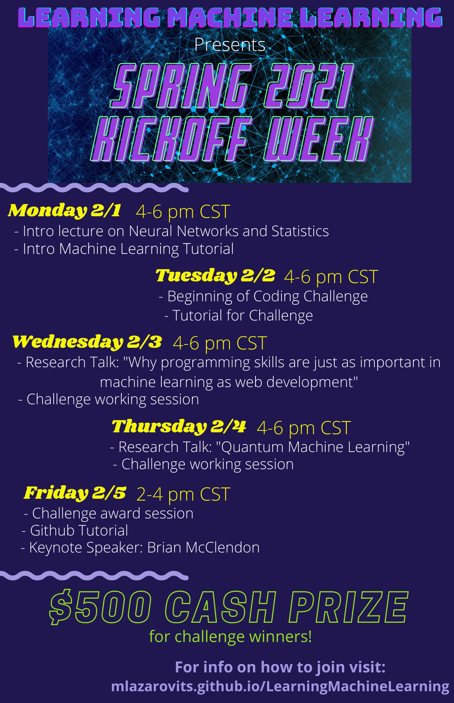

## Upcoming
### Spring 2021 Kick-off

Zoom Meeting ID: 935 113 0111  
Passcode: 0101

4-6 pm every day (2-4 pm Friday 2/5)

| Date                                        | Event                                           |
| ------------------------------------------- | ----------------------------------------------- |
| February 1st |Introduction to Probability and Neural Networks with Prof. Chris Rogan   Installing ML Libraries with Prof. David Johnson |
| February 2nd | Introduction to Neural Networks with Chris Harvey |
| February 3rd | Why Programming Matters with Chris Harvey |
| February 4th | Quantum Machine Learning with Prof. Elizabeth Behrman |
| February 5th | Introduction to Github with Dalton Hahn   Keynote Speaker Brian McClendon |

<!--
{: .align-center}
-->

<figure style = "width: 400px" class="align-center">

</figure>

Watch here for updates on our schedule for Spring 2021!

## Past
### Spring 2020
Thursdays, 4-5 pm in Malott 6051

| Date                                        | Event                                           |
| ------------------------------------------- | ----------------------------------------------- |
| January 23rd    | Classes Start: No Meeting |
| January 30th|[Introduction to Statistics with Prof. Chris Rogan](../assets/notes_spring20/intro_stats_rogan.pdf){:target="_blank"}|
| February 6th | Overview of ML Algorithms for Text |
| February 13th | Introduction to Semester Project with Dr. Midam Kim |
| February 20th | Elections and Paper Dicussion: TBD |
| February 27th |  ML for Audio Processing with Ali Khalighifar |
| March 5th    | Paper Discussion: TBD |
| March 12th   | Spring Break: No Meeting |
| March 19th   | Machine Learning, Security, and Privacy with Professor Drew Davidson |
| March 26th   | Project Review with Dr. Midam Kim |
| April 2nd   | Working Meeting |
| April 9th  | Working Meeting |
| April 16th  | Ethics of Machine Learning with Professor John Symons |
| April 23th  | Working Meeting |
| April 30th   | Working Meeting |
| May 7th  | Working Meeting |
| May 14th  | Finals Week: No Meeting |

### Fall 2019
Wednesdays, 4-5 pm in Malott 6051

| Date                                        | Event                                           |
| ------------------------------------------- | ----------------------------------------------- |
| August 28th    | Classes Start: No Meeting |
| September 4th  | [Statistics Crash Course with Prof. Chris Rogan](../assets/notes_fall19/LML_Notes9_4_19.pdf){:target="_blank"}  |
| September 11th | [Linear Regression Tutorial with Dr. Sadia Khalil](https://github.com/skhalil/DataScience/tree/master/Regression/LinearRegressionTutorial){:target="_blank"} |
| September 18th | Machine Learning Basics with Prof. Chris Rogan |
| September 25th | [Introduction to Neural Networks Tutorial with Dr. Sadia Khalil](https://github.com/skhalil/DataScience/blob/master/Projects/AdidasVsNike/CNN_NikeVsAdidas_Classifier.ipynb){:target="_blank"}|
| October 2nd    | Classifying Insects with Neural Networks with Ali Khalighifar |
| October 9th    | Brainstorming Session |
| October 16th   | Brainstorming Session |
| October 23rd   | Mining Imperfect Data with Prof. Jerzy Grzymala-Busse |
| October 30th   | Meeting Cancelled - Weather |
| November 6th   | Brainstorming Session |
| November 12th  | Fast Machine Learning with Professor Javier Duarte |
| November 19th  | Brainstorming Session |
| November 26th  | Brainstorming Session |
| December 3th   | Gaussian Processes with Dr. Hartwin Peelaers |
| December 10th  | Brainstorming Session |
| December 19th  | Finals Week: No Meeting |

### Summer 2019
Wednesdays, 4-5 pm in Malott 6051

| Date                                        | Event                                           |
| ------------------------------------------- | ----------------------------------------------- |
| June 26th | [Statistics Crash Course](https://docs.google.com/document/d/1TytG7SGqHsUcyYcGbJ3RKZZ6qNZHJ0K4kKyz5tFsf3c/edit?usp=sharing){:target="_blank"} by Dr. Chris Rogan |
| July 3rd 	| [Machine Learning Basics by Dr. Chris Rogan and Linear Regression Tutorial by Dr. Sadia Khalil](https://docs.google.com/document/d/1RJ_oYthze6tC1zEenNB9cQYQzkho-4tpc_cAtS9jg5I/edit?usp=sharing){:target="_blank"} |
| July 10th | Paper Discussion: [Conditional Neural Processes](../assets/papers_summer19/conditional_NN.pdf){:target="_blank"} [Discussion Slides](../assets/pwrpts_summer19//Conditional\ Neural\ Processes.pptx){:target="_blank"} |
| July 17th | Paper Discussion: [Quantum Machine Learning](../assets/papers_summer19/quantum_ML.pdf){:target="_blank"} |
| July 24th | Tutorial: [Introduction to Tensorflow](https://www.tensorflow.org/guide/low_level_intro){:target="_blank"}|
| July 31st | Paper Discussion: [Batch Normalization: Accelerating Deep Network Training by Reducing Internal Covariate Shift](../assets/papers_summer19/batch_normalization.pdf){:target="_blank"} |
| August 7th | Paper Discussion: [Generative Adversarial Nets](../assets/papers_summer19/GANs_1406.261.pdf){:target="_blank"} [Presentation](../assets/pwrpts_summer19/GAN Presentation.pdf){:target="_blank"} |
| August 14th | Tutorial: [Generative Adversarial Network Tutorial](https://blog.paperspace.com/implementing-gans-in-tensorflow/){:target="_blank"} (see ML Resources page for a more recent version of this tutorial)|

### Spring 2019

| Date                                        | Event                                           |
| ------------------------------------------- | ----------------------------------------------- |
| January 24th | [Introductions and Goal Setting](https://drive.google.com/open?id=1qbSq3MJL1OtkkbGKroCjJV9QmEAoytHbu-W1E4ztd4A){:target="_blank"} |
| January 31st | [Machine Learning Basics by Dr. Chris Rogan](https://drive.google.com/open?id=1mBRXBfIwFADrweo23Wr3eKeDEVUj8t3iQssQxYLTZeQ){:target="_blank"} |
| February 7th | No Meeting - Campus Closed |
| February 14th | [Introduction to Neural Networks and Predictive Modelling by Dr. Rogan & Predicting Lawrence Temperatures by Duncan](https://drive.google.com/open?id=16zNK4PLBPW7SFDTEbJWI2jSFz9swaZSrXjXs2K6iYsI){:target="_blank"} |
| February 21st | [Reviews are Terrible by Dr. Jennifer Delgado & Tagging Low pT b-jets by Erich Schmitz](https://drive.google.com/open?id=1gm332MINuNEsj6oUqVi_aMCzegNGaiEhAHVe-AcLLCU){:target="_blank"}|
| February 28th | Analyzing Peculiar Velocities from Kinetic Sunyaev-Zel'dovich Effect by Yuyu & Machine Learning with the MIP Timing Detector by Margaret |
| March 7th | Towards measurement of the UCEHR with the ARA experiment and Neutrino and UHECR detection through RADAR technique by Uzair & Using CNNs to Extract Signal from bbar Backgrounds in double Higgs Production by Dr. Han Kim |
| March 14th | No Meeting - Spring Break! |
| March 21st | [Follow up and brainstorm: Predicting Lawrence Temperature](https://drive.google.com/open?id=1nAFSZSAuTLRfN2Kt71lJaCzy_OZuSolvIwFxOo9mBgw){:target="_blank"} |
| March 28th | [Follow up and brainstorm: AReviews are Terrible & Tagging Low pT b-jets](https://drive.google.com/open?id=1i58ApKUiN6G7UeV8LNPxoagdbGJoDOnFaXYYQHqlNos){:target="_blank"} |
| April 4th  | [Follow up and brainstorm: Analyzing Peculiar Velocities from Kinetic Sunyaev-Zel'dovich Effect & Analyzing LGAD Sensor Waveforms for the MTD](https://drive.google.com/open?id=1ywMT0QOx41reEuNjbN1dZU-w22XtuR6WFQC-G-mRYHc){:target="_blank"} |
| April 11th  | [Follow up and brainstorm: Neutrino and UHECR Detection through RADAR Technique & Using CNNs to Extract Signal from bbar Backgrounds in double Higgs Production](https://drive.google.com/open?id=11WUnuR82SF1GhrtLbVuktaXM_rN7E7G1KIk5CGikHTA){:target="_blank"} |
| April 18th | [Present on Progress: Using CNNs to Extract Signal from bbar Backgrounds in double Higgs Production](https://drive.google.com/open?id=1kj3N-jU7jnCUQj8eT7WhG-GnO1og2S_NqPZimcCnzsk){:target="_blank"} |
| April 25th | Present on Progress: Reviews are Terrible & Predicting Lawrence Temperature |
| May 2nd | Present on Progress: Analyzing Peculiar Velocities from Kinetic Sunyaev-Zel'dovich Effect & Tagging Low pT b-jets |
| May 9th | Feedback, future plans and goal assessing |

Spring 2019 Projects

- [Reviews are Terrible by Dr. Jennifer Delgado](../assets/pwrpts_spring19/jd_ml_2_21_19.pdf){:target="_blank"}

- [Tagging Low pT b-jets by Erich Schmitz](../assets/pwrpts_spring19/Tagging_Low_p_T_B_Jets.pdf){:target="_blank"}

- [Analyzing Peculiar Velocities from Kinetic Sunyaev-Zel'dovich Effect by Yuyu Wang](../assets/pwrpts_spring19/ksz_new_ML.pdf){:target="_blank"}

- [Machine Learning with the MIP Timing Detector by Margaret Lazarovits](../assets/pwrpts_spring19/ML_with_MTD.pdf){:target="_blank"}

- [Towards measurement of the UCEHR with the ARA experiment and Neutrino and UHECR detection through RADAR technique by Uzair Latif](../assets/pwrpts_spring19/MLgroup.pdf){:target="_blank"}

